  <!-- <strong>🇬🇧 English</strong> | <a href="README.ru.md">🇷🇺 Русский</a> -->
  <!-- <strong>🇬🇧 English</strong>  -->

<h1 align="center">Andrey</h1>
<h3 align="center">Software Developer | Crafting Scalable Solutions</h3>

  

---

### About Me

I am a software developer focused on building performant and scalable applications. My objective is to design reliable and intuitive solutions.

- Current focus: **High-performance Telegram bot storefronts and Web Apps**
- I utilize **AI Agents (Codex, Claude Code, GitHub Copilot)** for architecture design, rapid prototyping, and workflow optimization.
- Professional interests: **AI Implementation & Integration, Advanced Cloud Architecture, and Systems Design**
- Core competencies: **TypeScript, Node.js, and React**
- Environment: **15 years of Linux experience**, currently using **Arch Linux** as my primary system

---

### Featured Projects

- **Algorithmic Crypto Trading Bot**: Developed a successful and performant algorithmic trading bot executing automated strategies on major cryptocurrency exchanges. Built for speed and reliability.
  - **Tech Stack:** Python, PostgreSQL, Redis, Docker
- **Telegram VPN Shop Bot**: Built an automated Telegram storefront that handles user subscriptions and seamless payments for a personal VPN service. Provides users with instant access and account management.
  - **Tech Stack:** TypeScript, Node.js, PostgreSQL

---

### Tech Stack

  
  
  
  
   
  
  
  
  

---

### GitHub Stats

<!-- 

  
    
  
    
  

 -->
---

### Contact Me

  
  

 

  <i>Open to professional collaboration.</i>

